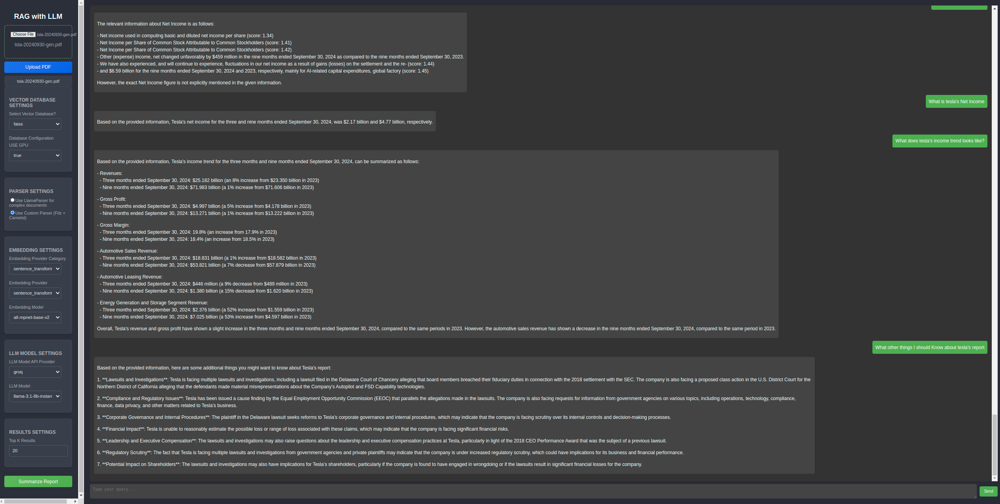

# **RAG System for Document Query and Summarization with Flask or FastAPI**

This project is a Retrieval-Augmented Generation (RAG) system designed for querying and summarizing documents. It supports GPU and CPU environments, and the backend can run using either Flask (`RAG.py`) or FastAPI (`RAG_fastapi.py`). The frontend provides a user-friendly interface for uploading documents and interacting with the system.


---

## **Table of Contents**

1. [Overview](#overview)
2. [Setup and Installation](#setup-and-installation)
   - [Backend Setup](#backend-setup)
   - [Frontend Setup](#frontend-setup)
   - [Docker Setup](#docker-setup)
3. [Usage](#usage)
   - [Running the Backend](#running-the-backend)
   - [Running the Frontend](#running-the-frontend)
   - [GPU and CPU Configurations](#gpu-and-cpu-configurations)
   - [Switching Between Flask and FastAPI](#switching-between-flask-and-fastapi)
4. [Project Structure](#project-structure)
5. [Key Features](#key-features)
6. [Troubleshooting](#troubleshooting)

---

## **Overview**

The RAG system uses vector-based search and large language models (LLMs) to enable:
- Document uploads and storage.
- Advanced querying using embeddings.
- Document summarization.

It supports various embedding providers (e.g., OpenAI, Llama, Groq) and works in GPU and CPU environments for optimized performance.

The RAG system now supports multiple vector databases for efficient storage and retrieval of embeddings. A dedicated `Database_Readme.md` file provides detailed instructions for configuring and using each supported database.

---


### **Database Configurations**

For detailed information on supported vector databases (e.g., FAISS, Milvus, Pinecone, Qdrant, Weaviate) and their configurations, see [**Database_Readme.md**](./backend/Database_Readme.md).

---

### **Preview**

Below is a visual representation of the RAG system architecture and user interface:

#### **User Interface**


---

## **Setup and Installation**

### **Prerequisites**
- **Python 3.11** (with Conda for backend environment management)
- **Node.js** (for the frontend)
- **Docker** (optional for containerized deployment)
- **Git** (for cloning the repository)

---

### **Backend Setup**

1. **Navigate to the backend directory**:
   ```bash
   cd backend
   ```

2. **Create and activate a Conda environment**:
   ```bash
   conda env create -f src/environment.yml
   conda activate rag_env
   ```

3. **Install dependencies**:
   ```bash
   pip install -r requirements.txt
   ```

4. **Run the backend**:
   - For Flask:
     ```bash
     python src/RAG.py
     ```
   - For FastAPI:
     ```bash
     python src/RAG_fastapi.py
     ```

---

### **Frontend Setup**

1. **Navigate to the frontend directory**:
   ```bash
   cd frontend
   ```

2. **Install dependencies**:
   ```bash
   npm install
   ```

3. **Start the development server**:
   ```bash
   npm start
   ```

The frontend will be available at `http://localhost:3000`.

---

### **Docker Setup**

The project includes Docker support for both GPU and CPU environments.

1. **Build the Docker image**:
   - **GPU Environment**:
     ```bash
     docker build --build-arg USE_GPU=true -f backend/Backend.gpu.dockerfile -t rag-system-gpu .
     ```
   - **CPU Environment**:
     ```bash
     docker build --build-arg USE_GPU=false -f backend/Backend.cpu.dockerfile -t rag-system-cpu .
     ```

2. **Run the Docker container**:
   - **GPU**:
     ```bash
     docker-compose -f docker-compose.gpu.yml up
     ```
   - **CPU**:
     ```bash
     docker-compose -f docker-compose.cpu.yml up
     ```

---

## **Usage**

### **Running the Backend**

To start the backend directly without Docker:
- Flask:
  ```bash
  python backend/src/RAG.py
  ```
- FastAPI:
  ```bash
  python backend/src/RAG_fastapi.py
  ```

---

### **GPU and CPU Configurations**

The backend dynamically supports both GPU and CPU setups:
- For GPU-based setups, ensure `faiss-gpu` is installed and the `USE_GPU` environment variable is set to `true`.
- For CPU setups, `faiss-cpu` should be installed instead.

If using Docker, the provided `docker-compose` files will handle these configurations automatically.

---

### **Switching Between Flask and FastAPI**

To switch between Flask and FastAPI when using Docker:
- Set the `RAG_SERVER` environment variable:
  - **Flask**:
    ```bash
    docker run -e RAG_SERVER=flask -p 5000:5000 rag-system
    ```
  - **FastAPI**:
    ```bash
    docker run -e RAG_SERVER=fastapi -p 5000:5000 rag-system
    ```

---

## **Project Structure**

```
project-root/
│
├── README.md                       # Main project documentation
├── LICENSE                         # Project license
├── .gitignore                      # Git ignore file
├── Database_Readme.md              # Detailed documentation for database setup
├── docker-compose.yml              # Default Docker Compose configuration
├── docker-compose.gpu.yml          # Docker Compose configuration for GPU
├── docker-compose.cpu.yml          # Docker Compose configuration for CPU
│
├── assets/                         # Folder for project assets (images, diagrams, etc.)
│
├── data/                           # General data folder
│
├── frontend/                       # Frontend (React) directory
│   ├── rag-ui/                     # React application
│   │   ├── public/                 # Static assets
│   │   ├── src/                    # Source code
│   │   ├── package.json            # Frontend dependencies
│   │   ├── .env                    # Frontend environment configuration
│
├── backend/                        # Backend (Python) directory
│   ├── __pycache__/                # Python cache files
│   ├── data/                       # Data-related files
│   ├── vector_dbs/                 # Vector DB index files
│   ├── src/                        # Source code
│   │   ├── __pycache__/            # Python cache files for `src`
│   │   ├── adapters/               # Vector database adapters
│   │   │   ├── __pycache__/        # Python cache files for `adapters`
│   │   │   ├── __init__.py         # Package initialization
│   │   │   ├── faiss_adapter.py    # FAISS vector DB adapter
│   │   │   ├── milvus_adapter.py   # Milvus vector DB adapter
│   │   │   ├── pinecone_adapter.py # Pinecone vector DB adapter
│   │   │   ├── qdrant_adapter.py   # Qdrant vector DB adapter
│   │   │   ├── weaviate_adapter.py # Weaviate vector DB adapter
│   │   ├── add_to_vector_db.py     # Script to add documents to vector DB
│   │   ├── config.yaml             # Configuration file for databases
│   │   ├── embedding_config.py     # Embedding model configuration
│   │   ├── embedding_initializer.py # Embedding model initialization logic
│   │   ├── environment.yml         # Conda environment file
│   │   ├── id_map.pkl              # ID mapping for vectors
│   │   ├── main.py                 # Unified entry point for the backend
│   │   ├── RAG_fastapi.py          # FastAPI-based backend
│   │   ├── rag_models.py           # RAG models and processing logic
│   │   ├── RAG.py                  # Flask-based backend
│   │   ├── VectorDB.py             # Vector database management logic
│   ├── .env                        # Backend environment configuration
│   ├── Backend.cpu.dockerfile      # Dockerfile for CPU-specific setup
│   ├── Backend.gpu.dockerfile      # Dockerfile for GPU-specific setup
│   ├── id_map.pkl                  # ID mapping file
│   ├── requirements.txt            # Backend dependencies
│   ├── start_server.sh             # Script to dynamically select Flask or FastAPI

```

---

## **Key Features**

- **Flask and FastAPI Support**: Run the backend with Flask (`RAG.py`) or FastAPI (`RAG_fastapi.py`).
- **GPU and CPU Compatibility**: Dynamically handles GPU or CPU setups based on the environment.
- **Document Querying**: Upload documents and perform advanced queries using embeddings.
- **Summarization**: Generate document summaries using vector-based retrieval.

---

## **Troubleshooting**

1. **Permission Errors**:
   - Ensure the `data/` and `backend/vector_dbs/` directories are writable:
     ```bash
     chmod -R 755 backend/vector_dbs
     chmod -R 755 data
     ```

2. **Missing Dependencies**:
   - Install missing Python packages:
     ```bash
     pip install -r backend/requirements.txt
     ```

3. **Docker Issues**:
   - Check container logs:
     ```bash
     docker logs <container_id>
     ```

4. **CORS Issues**:
   - Ensure the backend allows requests from the frontend:
     ```python
     from fastapi.middleware.cors import CORSMiddleware

     app.add_middleware(
         CORSMiddleware,
         allow_origins=["http://localhost:3000"],
         allow_methods=["*"],
         allow_headers=["*"],
     )